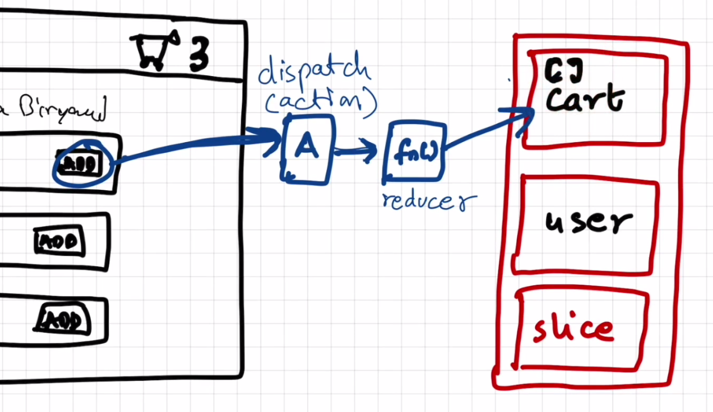
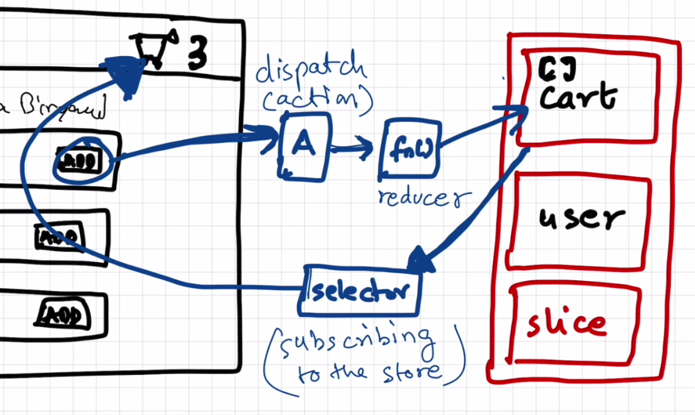

# we now study redux
 - note it down redux is not menditary thing

 - redux and react are different

 - dont depend heavily on redux

 - when  we use redux application is easier to debug

 - we use react redux library in our application(just search reduxjs.org)
 - visit redux toolkit

 
    - this is how we write the data
 here see the paragraph and read it carefully below
 - when we click on this add button ,it dispatches the action ,which calls the reducer function,which udates/modifies cart(slice) of store

      
       - this is how we read the data
 - we use selector to read the data from card(store) and it modify from our react component ,give the data,and this phenomina is called subscribing to the store
 - so our header component subscribed to store using selector

 -this is how the whole cycle works
    