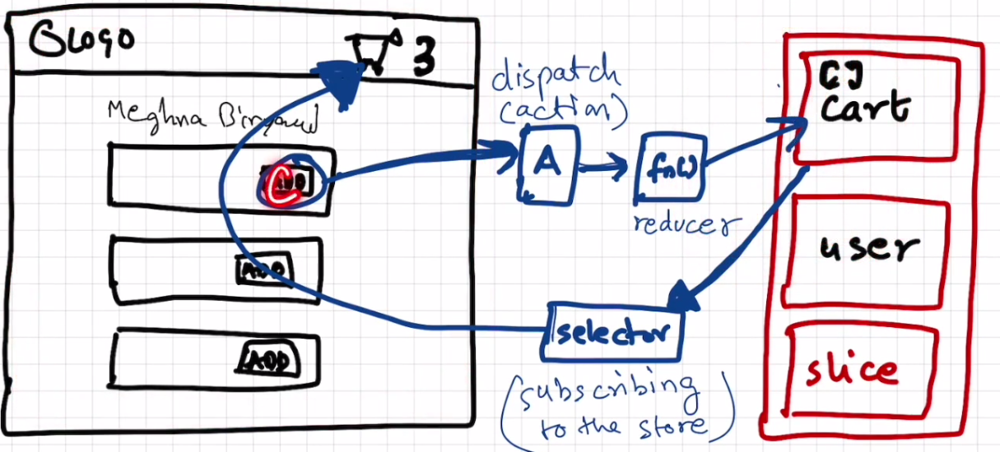

# we now study redux
 - note it down redux is not menditary thing

 - redux and react are different

 - dont depend heavily on redux

 - when  we use redux application is easier to debug

 - we use react redux library in our application(just search reduxjs.org)
 - visit redux toolkit

 
    - this is how we write the data
 here see the paragraph and read it carefully below
 - when we click on this add button ,it dispatches an action ,which calls the reducer function,which udates/modifies cart(slice) of store

      
       - this is how we read the data
 - we use selector to read the data from card(store) and it modify from our react component ,give the data,and this phenomina is called subscribing to the store
 - so our header component subscribed to store using selector

 -this is how the whole cycle works
    

    

# redux toolkit
 - Install libraries-redux toolkit which is @reduxjs/toolkit and react-redux
 - Build our store
 - Connect our store to our app
 - Slice (cartSlice)
 - dispatch(action)
 -selector 

 first install npm install @reduxjs/toolkit ,then install react-redux

 - lets create now appStore.js in utils

 - please search the difference between this three
       onClick={handleAddItem}
       onClick={()=>handleAddItem(item)}
       onClick={handleAddItem(item)}  you should know ,this is normal javascript

       - install redux dev tools extension 

       - use redux when component becomes so complicated as so many subscribes

       - https://redux-toolkit.js.org/introduction/getting-started ,go to the website and read RTK Query,RTK Query Quick start

       - in older version of redux we use middlewere ,thungs earlier

       - 