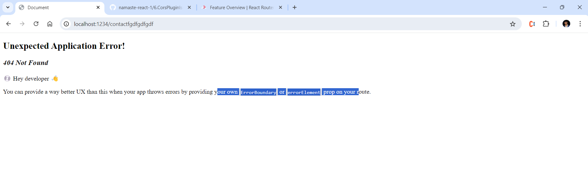
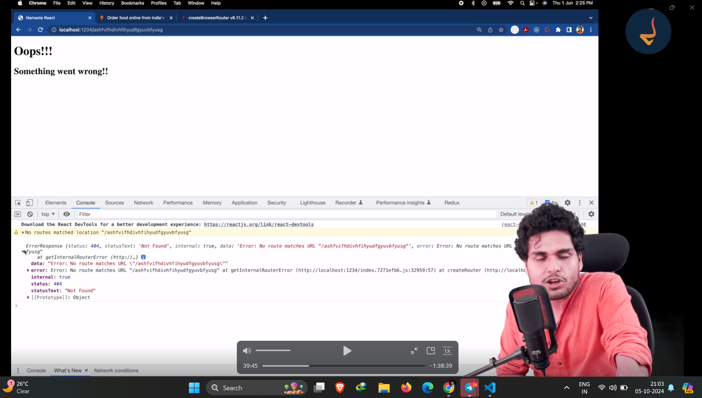

#  install a library "react router DOM" 
- to install write in console "npm i react-router-dom" 
- then "npx parcel index.html"
- for more information please visit https://reactrouter.com/en/main/start/overview
- please go ahead with website and please read about routers

- at app.js write routing configuration

- what is page its a group of component

- if we write a rndom route supppose anything like http://localhost:1234/bcbcvbcvbc then it shows some error message but if you want to write your own error messages then the code shows in Error.js

- import { useRouteError } from "react-router-dom";  // it will give some more information about error

- if we be in any route out header is not shown to tackel this as body can change 
- but our headershould be at their place so we see this in part4