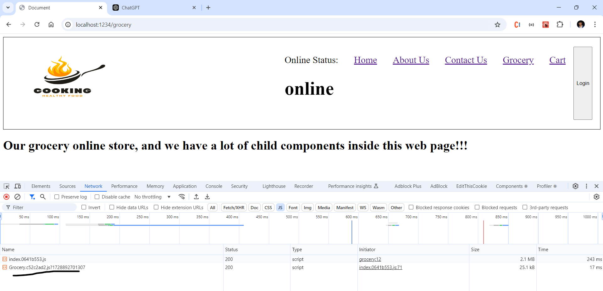

# we will study now single responsibility

# today we will create our own hook

- hooks arwe nothing but normal utility functions(normal function)

- bundling bundles the react code to single javascript file ,as there in dist folder

- as our app becomes bigger and bigger , like adding grocery we need to create separate bundles for the perticularr functions- which we do by lazy loading

  
 - above network page shows how lazy loading splits code to two javascript codes 