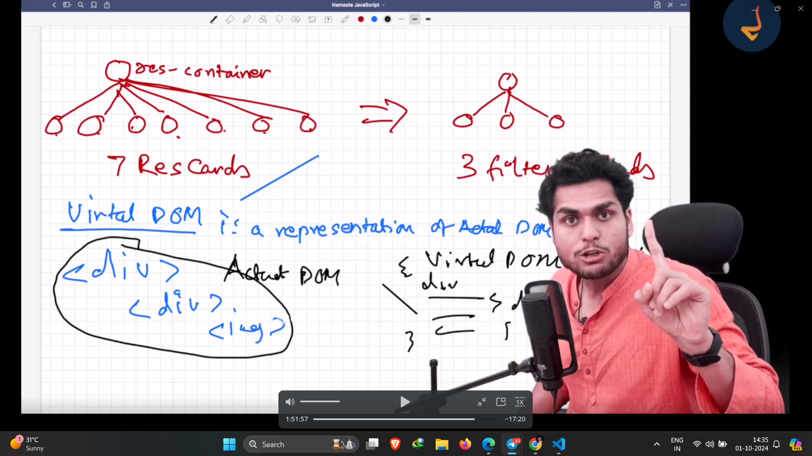
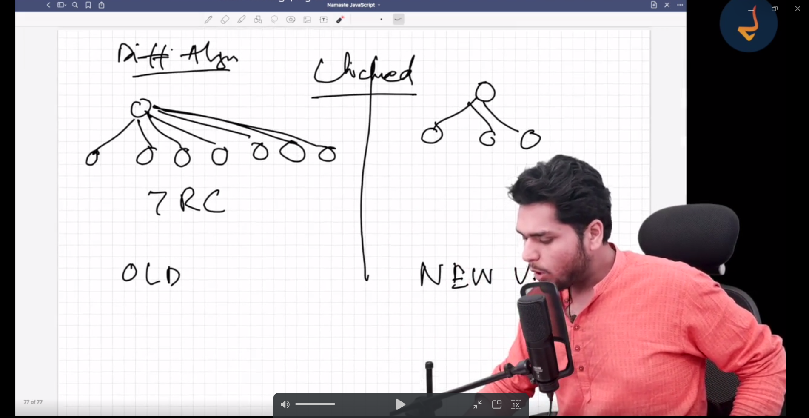

- we have huge code in a single file(app.js) so we break our app into multiple files

- we kind of put the file into src folder , so lets create this folder so we put app.js to src folder

# Namaste Food
/**
 * Header
 *  -Logo
 *  - Nav Items
 * Body
 *   -Search
 *   -RestaurantContainer
 *     - RestaurantCard
 *      - Img
 *      - Name of Res,Star Rating , cuisins, delivery time
 *   Footer
 *      -Copyright
 * - Links
 * -Address
 *   -Contact
 * 
 */  

 - keep the code simple 

 # Two types of Export/Import

 - Default Export/Import

  export default Component;
  import Component from "path";

 - Named Export/Import

 export const Component;
 import {Component} from "path";

 # Now we will make our app dynamic by adding some features to it

- let us create a button 
# React is fast and efficient in dom manipulation

# What is functional component
  - normal js function

  # React HOOK
  - normal Javasscript function hassome logic written behind it
   - (Normal JS utility functions)
   - two very important hooks
   - useState() - Superpowerful react variable(gives powerful state variable)
   - useEffect() - 

   # How react work behind the seen
     - Reconciliation Algorithm (ReactFiber)

     - Diff Algorithm means 
     

  # For more information search react fiber https://github.com/acdlite/react-fiber-architecture
   - read
   -imp- react is effentialy find out the difference between virtual dom

   - why react is fast - because it has virtual dom ,please read reconsilation