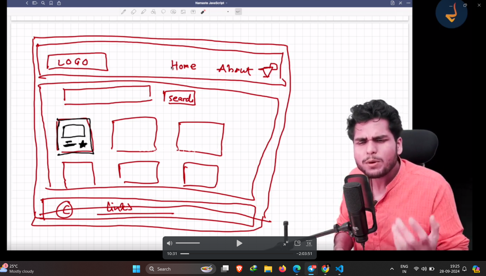

# Here first of all i want to tell you that if your planning is good ,writing code is easy so take down your pan and paper and plan with me so before making project do planning with pen and paper

- passing a prop to the component is like passing an argument to funtion